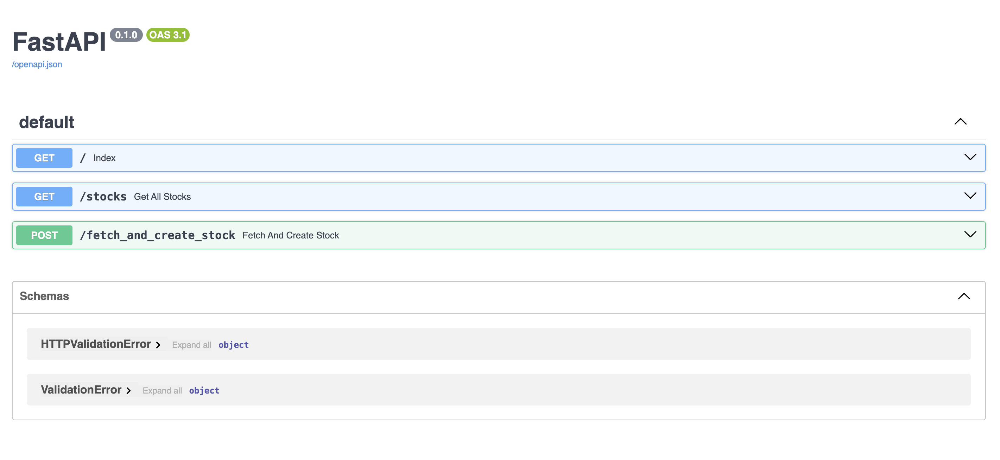

# Bot Stock

## Descripción

El proyecto **Bot Stock** es una aplicación que utiliza un bot para realizar consultas y manejar datos de acciones del mercado. Está diseñado para interactuar con una base de datos PostgreSQL y proporcionar una API utilizando FastAPI. El frontend está construido con React y se sirve a través de Nginx.

## Requisitos

Antes de empezar, asegúrate de tener instaladas las siguientes herramientas:

- [Docker](https://www.docker.com/get-started)
- [Docker Compose](https://docs.docker.com/compose/install/)
- [Python](https://www.python.org/downloads/)
- [Node.js](https://nodejs.org/en/download/)

## Configuración del Proyecto

1. **Clonar el Repositorio**

   ```bash
   git clone https://github.com/luissamano/bot_stock.git
   cd bot_stock
   ```

2. **Crear Archivos `.env`**

   Es necesario crear dos archivos `.env` uno va dentro de la carpeta frontend y el otro en la raiz del proyecto.


   Asegúrate de definir las variables de entorno necesarias en el archivo `.env`. Por ejemplo:

   **Archivo 1 (Dentro de la carpeta frontend)**
    ```env
   REACT_APP_API_URL=http://localhost:8000
   ```
   
   **Raiz del proyecto:**
   ```env
   DB_NAME=stocks
   DB_USER=postgres
   DB_PASS=postgres
   API_KEY=
   DB_HOST=bot_stock-db-1
   ```

    > Para obtner tu API_KEY [aqui](https://marketstack.com/)

## Instalación y Ejecución

1. **Construir y Levantar los Contenedores**

   Ejecuta Docker Compose para construir y levantar los contenedores.

   ```bash
   docker-compose up --build
   ```

   Esto construirá las imágenes para el backend y el frontend, y levantará los contenedores de PostgreSQL, FastAPI y React.

2. **Acceder a la Aplicación**

   - **Frontend (React):** [http://localhost](http://localhost)
   - **Backend (FastAPI):** [http://localhost:8000](http://localhost:8000)

   La aplicación frontend se sirve en el puerto 80, mientras que el backend de FastAPI está disponible en el puerto 8000.

## Uso

- **API Endpoint para Consultar Acciones**

  `GET /stocks` - Obtiene todos los registros de acciones.

- **API Endpoint para Crear una Acción**

  `POST /fetch_and_create_stock` - Crea una nueva acción a partir de un símbolo proporcionado.

  **Parámetros:**
  - `symbol`: El símbolo de la acción a buscar.

  **Ejemplo de Solicitud:**

  ```bash
  curl -X 'GET' \ 'http://localhost:8000/stocks' \ -H 'accept: application/json'
  ```

> La API cuenta con SWAGGER, puedes aceder a la UI [aqui](http://localhost:8000/docs)



